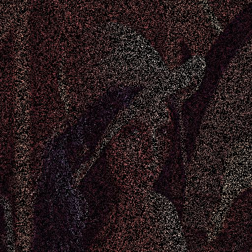
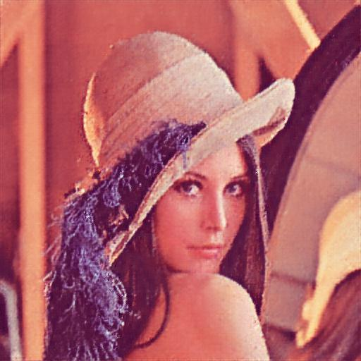
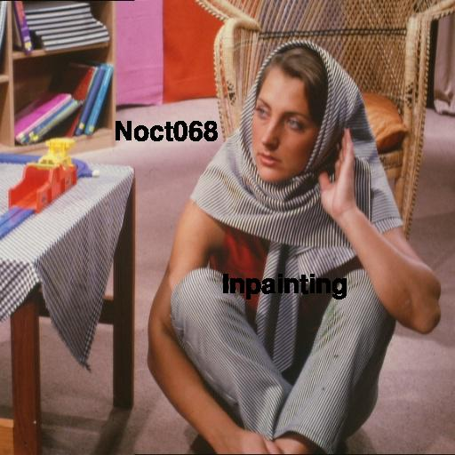
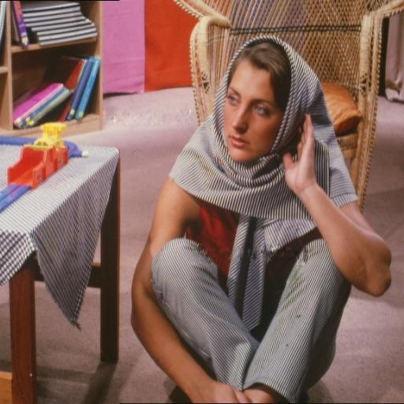

## Denoising 

Filling removed pixels with appropriate pixel value for denoising

        Original Image                          Masked Image                        Output Image
<div align='center'>
    
    
    
</div>


## Text Inpainting

Removing text masks from image

        Original Image                          Masked Image                        Output Image
<div align='center'>
    
    
    
</div>


## Files

```
├── src                   
|    ├── masks.py
|    |   ├── FreeSansBold.ttf               # font
|    |   ├── pixel noise mask               # removing pixels from image
|    |   └── pixel text mask                # add text mask to image
|    |
|    └── model.py                           # Pytorch Deep Image Prior Model 
|    
|                                           
├── notebooks
|    |
|    ├── Denoising and Inpainting.ipynb     # Jupyter Notebook with Pytorch Deep Image Prior
|    └── text-inpaint.ipynb                      # Jupyter Notebook with tensorflow Pixel CNN for text inpainting
|
├── denoise_run.py                          # Train and save output denoised image
└── inpaint_run.py                          # Train and save output text inpainted image
├── images                                  # input, masked and output images  
└── README.md

```

### RUN
```
python3 denoise_run.py
python3 inpaint_run.py
```
## Reference

**Dmitry Ulyanov et. al** *Deep Image Prior* [[arxiv](https://arxiv.org/abs/1711.10925)]
